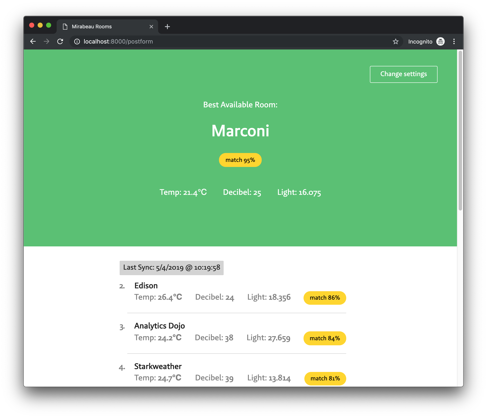

**🎓 Project 2 @cmda-minor-web-18-19**

# Choose Your Ideal Mirabeau Room

With this application employees of [Mirabeau](https://www.mirabeau.nl/en) can find their ideal meeting room based on `temperature`, `lightning` and `noise`.

Check out the application [here](https://mirabeau-smart-office.herokuapp.com/form)!



Mirabeau Amsterdam is a ‘smart office’. Every meetingroom has sensors. Mirabeau receives and stores a variety of these measurements in an API.

Users can define their preferences with sliders. The application combines these preferences with the data from the API and calculates the best match.

## Install

```
git clone https://github.com/sterrevangeest/project-2-1819.git

cd project-2-1819

npm install

npm run server
```

## To do:

- [x] Application works without JavaScript (by making a server side app)
- [x] Optimize the performance off the application with HTML&CSS minify, compression and caching.
- [ ] Create an offline page
- [ ] Cach files with a service worker so user can still see latest sync when they are offline.
